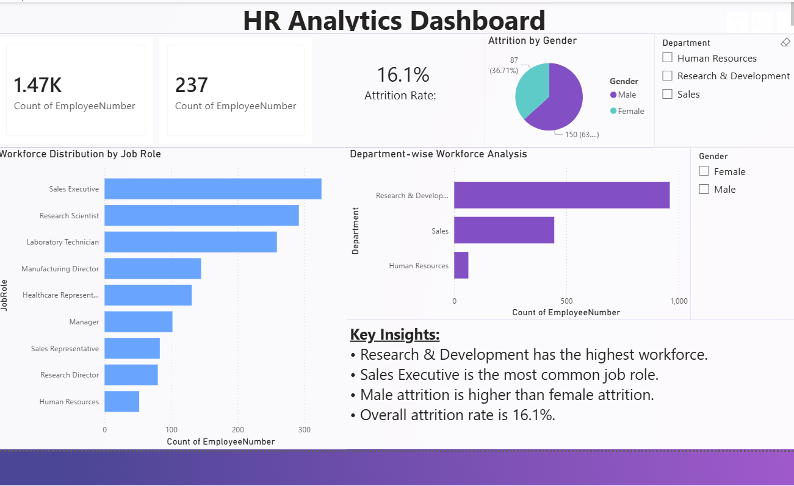
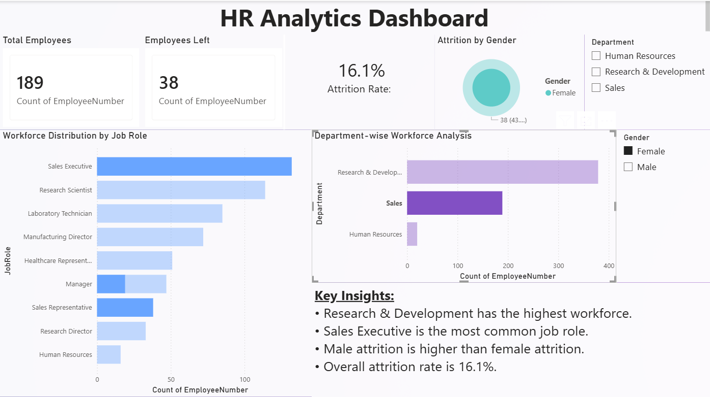
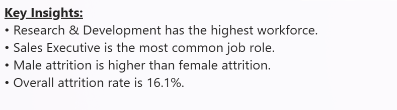

# README.md

# HR Analytics Dashboard using Power BI

## 📌 Project Overview

This project is an interactive HR Analytics Dashboard developed using Power BI.
The dashboard helps analyze employee attrition, workforce distribution, departmental performance, and gender-based attrition trends.

The objective of this project is to transform raw HR employee data into meaningful business insights through interactive visualizations and KPI analysis.

---

## 🚀 Features

- Total Employees KPI
- Attrition Count & Attrition Rate
- Department-wise Workforce Analysis
- Workforce Distribution by Job Role
- Attrition Analysis by Gender
- Interactive Slicers and Filters
- Business Insights Section

---

## 📊 Tools & Technologies Used

- Power BI Desktop
- CSV Dataset
- Data Visualization
- Dashboard Design
- Data Analysis

---

## 📈 Key Insights

- Research & Development has the highest workforce.
- Sales Executive is the most common job role.
- Male attrition is higher than female attrition.
- Overall attrition rate is approximately 16.1%.

---

## 📂 Project Structure

```bash
CodeAlpha_HR_Analytics
│
├── screenshots
│   ├── dashboard_overview.png
│   ├── dashboard_filtered.png
│   └── dashboard_insights.png
│
├── HR_Employee_Data.csv
├── HR_Analytics_Dashboard.pbix
├── requirements.txt
└── README.md
```

---

## 📷 Dashboard Preview

### Main Dashboard



### Filtered Dashboard



### Insights Dashboard

## 

## 🎯 Learning Outcomes

Through this project, I learned:

- Power BI dashboard creation
- Data cleaning and visualization
- KPI analysis
- Interactive report designing
- Business insight generation

---

## 👩‍💻 Author

Diksha Sinha
B.Tech CSE Student
